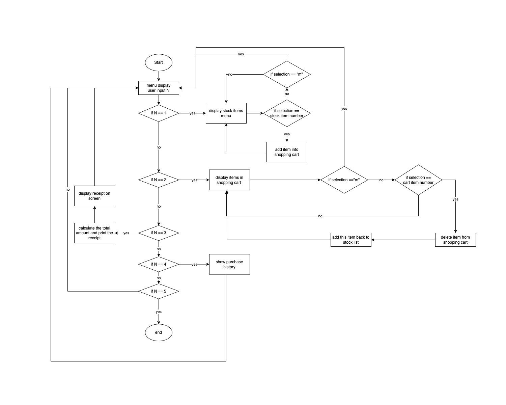
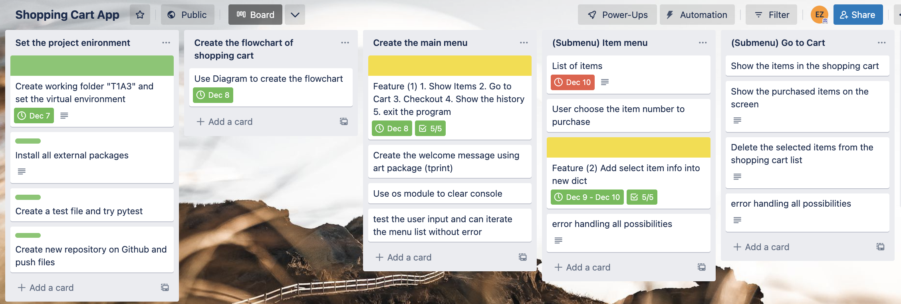
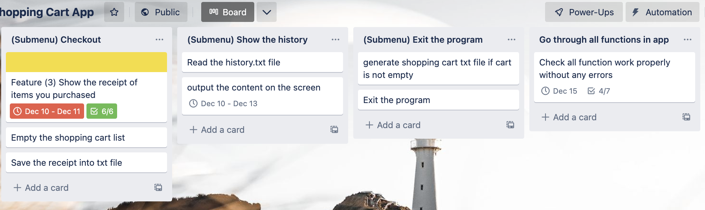
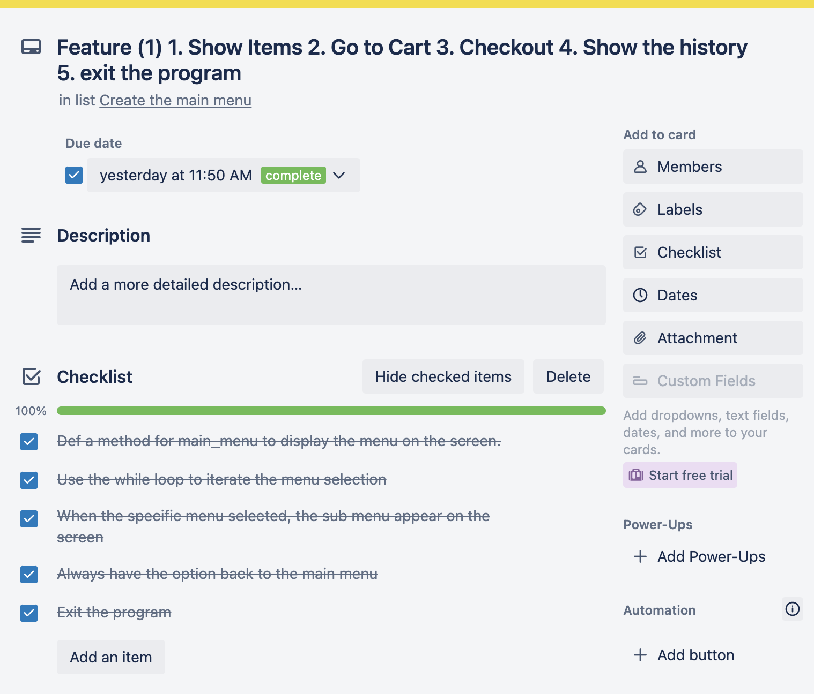
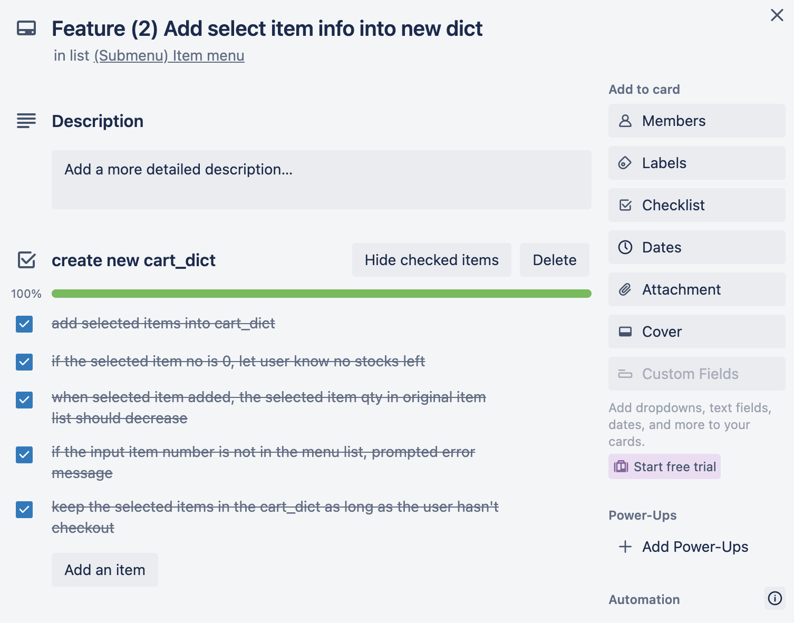
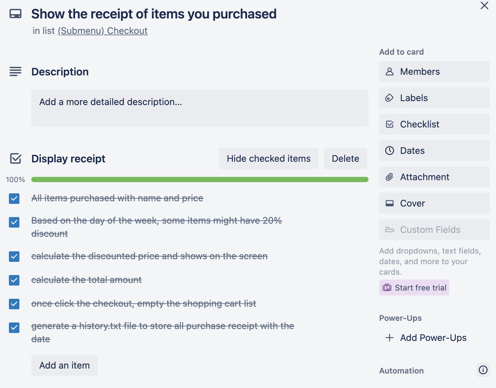

# GitHub Link
[Github Repo : https://github.com/Jiezhoue/JieZhou_T1A3.git](https://github.com/Jiezhoue/JieZhou_T1A3.git)

# Help documentation
This terminal application requires Python3 to run. If you don't know whether you have python3 installed or not, you can type below commond in your ternimal.

```
python3 --version
```

It will show which version of Python3 you installed. If you do not have Python3. You can go to Python offical website to install it.
- On Mac , use [these](https://wsvincent.com/install-python/#install-python-on-macos) instruction.
- On WSL, use [these](https://wsvincent.com/install-python/#install-python-on-linux) instruction.

User the commond line mentioned before to check if Python3 successfully installed or not.

Unzip the JieZhou_T1A3 folder and nagivate to the src folder inside using this commond

```
cd [YOUR DOWNLOAD ZIP FILE FOLDER]/JieZhou_T1A3/src
```

Create the virtual environment to install some packages and run the application

```
python3 -m venv venv
```
Activate the virtual environment
```
Source venv/bin/activate
```
Install pytest, art, pandas packages

```
pip install -U pytest
```
```
pip install art
```
```
pip install pandas
```

Once everthing is set up, use the below script to start the program

```
.cupeacke_shop.sh
```

# Style Guide

The code style guide I choose is PEP 8. It provides the easy readability and consistency

- Indentation ( Use 4 spaces per indentation level )

```py
def delete_item(item_no):
    if cart_dict[item_no]["qty"] > 0:
        cart_dict[item_no]["qty"] -= 1
        if cart_dict[item_no]["qty"] == 0:
            cart_dict.pop(item_no)
        origial_dict[item_no]["qty"] += 1
    else:
        print("The item no is wrong, please select again....")
        input("enter to contine.....")
```

- Import

```py
from os import system
from art import *
import os.path
import json
from functions import *
from history import item
from datetime import datetime
```
- Pet Peeves

```py
while option != "5": 
    system("clear") 
    welcome()               # shop ASCII title using art package
    
    option = main_menu()    # return user input
    if option == "1":
```
- Adding whitespace around the operators

```py
if cart_dict[item_no]["qty"] > 0:
        cart_dict[item_no]["qty"] -= 1
        if cart_dict[item_no]["qty"] == 0:
            cart_dict.pop(item_no)
        origial_dict[item_no]["qty"] += 1
```

# Program control flowchart




# Features
## Feature 1.

```py
option = ""
option = main_menu()
```

```py
def main_menu(): # return the user input from the main menu
    print("1. Show Menu")
    print("2. Go to Cart")
    print("3. Checkout")
    print("4. Show purchase history")
    print("5. Exit the program")
    opt = input("Please select the option(1-5): ")
    return opt
```

The first Feature is Main menu in this program. It has 5 options for users to choose using while loop. As long as user select number is not equal to 5, the program will process different functions or error handling (user input is not 1-5). And always has the option to bring the user back to main menu during each function. The varibale "option" is a global scope


## Feature 2.

```py
def buy_item(item_no):
    if origial_dict[item_no]["qty"] == 0:
        print("Item not in stock......Please select other items")
    else:
        if item_no in cart_dict:
            cart_dict[item_no]["qty"] += 1
            origial_dict[item_no]["qty"] -= 1
            print(f'1 {cart_dict[item_no]["name"]} has been added to your cart.')
        else:
            cart_dict[item_no] = origial_dict[item_no].copy()
            cart_dict[item_no]["qty"] = 1
            origial_dict[item_no]["qty"] -= 1
            print(f'1 {cart_dict[item_no]["name"]} has been added to your cart.')
```

The second feature is add selected item into a new dictionary. It will use if statment to check different condition. Like if the stock quantity is 0, use can't select this item to purchase, it also is a kind of error handling to prevent the program crash. And some logical calculation like when the user purchase one specific item, the quantity of that item in the stock will decrease by 1 and the quantity of that item in shopping cart will increase by 1. If the user input item's number is not in the list, will let user know (error handling)


## Feature 3.

```py
elif option =="3":
    system("clear")
    tprint("Receipt")
    if len(cart_dict) != 0:         # checkout and display the receipt
        display_receipt(date, cart_dict)
        cart_dict = {}              # after checkout, empty the shopping cart
        input("enter to continue........")
    else:
        print("There is no item in cart.....")
        input("enter to continue........")
        continue 
```
The third feature is display the receipt on the screen when user select the checkout menu. It will show the date of purchase and the list of items purchased using for loop and total amount. And it handle the error by checking if the shopping cart is empty or not. There is an extra date function inside this menu which is checking if any purchased items are discount items.


# Implementation plan

I use trello as a project management platform to implement and track my project.




### Feature 1 checklist


### Feature 2 checklist


### Feature 3 checklist


This program is a kind of simulation of online shopping and checkout function we are using everyday. 
